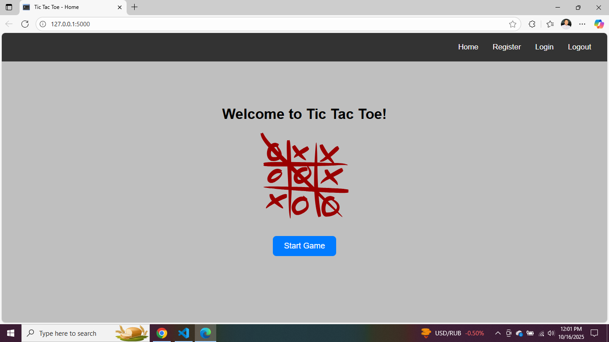
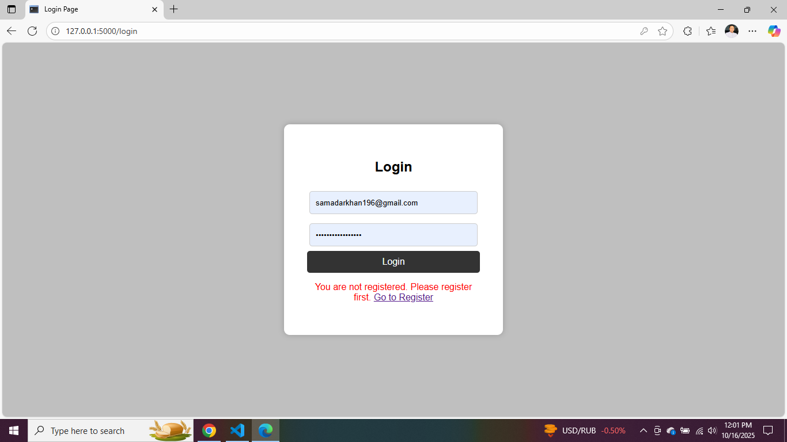
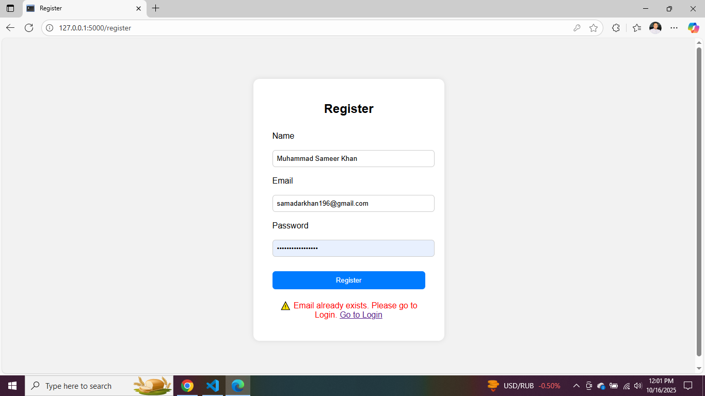
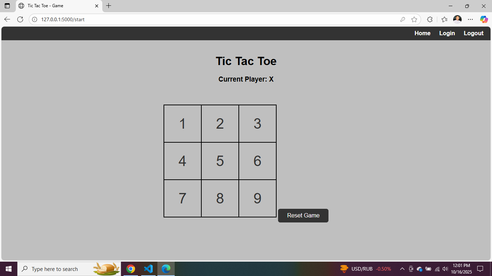

# 🎮 Tic-Tac-Toe Web Application (Flask + Python)

A web-based **Tic-Tac-Toe game** built with **Flask (Python)**, **HTML**, and **CSS**, using an **SQLite database** to store user accounts and game results.  
It supports **player login**, **registration**, and **real-time score tracking**, offering a smooth and interactive gameplay experience through a clean, responsive UI.

---

## 🧩 Features
- 🔐 User registration and login system (SQLite database)
- 🎲 Play Tic-Tac-Toe with live move tracking
- 🏆 Real-time score and win/draw detection
- 🧠 Smart backend logic for win validation
- 💾 Database storage for players and sessions
- 📱 Fully responsive — works on mobile and desktop

---

## 🖼️ Application Screenshots

### 🏠 Home Page


### 🔑 Login Page


### 📝 Register Page


### 🎮 Game Page


---

## 🛠️ Tech Stack
- **Backend:** Flask (Python)
- **Frontend:** HTML, CSS, Jinja Templates
- **Database:** SQLite3
- **Form Handling:** Flask-WTF, WTForms

---

## 🚀 How to Run Locally

```bash
# Clone the repository
git clone https://github.com/<your-username>/Tic-Tac-Toe_WebApplication-In-Python.git
cd Tic-Tac-Toe_WebApplication-In-Python

# Install dependencies
pip install flask flask-wtf wtforms

# Run the application
python app.py
